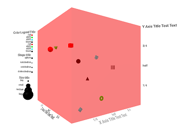

# gg-aframe

[](https://www.npmjs.com/package/gg-aframe)
[](https://www.npmjs.com/package/gg-aframe)

A Grammar of Graphics for Virtual Reality Data Visualization using
[A-Frame](https://aframe.io).



[View the examples page](https://wmurphyrd.github.io/gg-aframe/examples/)

## Data Binding

The `data-binding` component and system help get data from any source into
`gg-aframe` plots and keep it synchronized for interactive plots. It can be
thought of as a simplified, specialized version of the
[A-Frame state component](https://github.com/ngokevin/kframe/tree/master/components/state/)
that only handles array data. This allows you to have one central
data repository for the scene with a list of arrays that can be mapped and
synced to any A-Frame component's array properties. The central repository
simplifies the process of bringing data in from other libraries and sources,
as you only need to update in one place to affect the entire scene.
Arrays in the store can be reused to map
to multiple entities and components without any duplication of data,
and updates and will cascade changes to mapped components.

### data-binding system

The `data-binding` system holds a central data store, receives updates to that
store through events, and notifies bindees of updates. It is activated
automatically if `data-binding` component is added to any entity in a scene,
but it can also be forced to initialize by adding the `data-binding` attribute
to the scene entity.

#### Updating data

Data is added or updated by emitting the `'update-data'` event with a
`details` object that contains arrays as members.

```js
document.querySelector('a-scene').emit('update-data', {array1: [...], array2: [...]})
```

Each array will be added to the store if new or updated if it already exists,
and updates will propagate to any bound components. Any data store arrays
not included in the update will be left as-is.

### data-binding component

Add this component to bind arrays from the central store to components on
an entity. Multiple bindings can be added to an entity with the
`data-binding__id=""` syntax, where `id` is a unique identifier for
each `data-binding` component instance.

| Property | Description | Default Value |
| -------- | ----------- | ------------- |
| source | Name of an array in the data store | `''`* |
| target | Name of schema property, as `'component.property'`, on a sibling component to bind (optional) | `''` |

\* If source is omitted, will attempt to use the component multiple id as the
source name. Note: this only works for source names that are all lower case.

Once bound, the target property will be assigned to be the same array object
as the data store. `data-binding` will ensure the target component's
`update` method is called whenever the data store is updated.
Alternatively, omit `target` property and
access the `boundData` property of the component
or in the details of `data-changed` events.

Treat the bound data as read-only. If modified in the target component or
`bound-data` component, changes will be reflected across the entire system to
all bindees, but they will not be notified of the change, causing loss of sync.
Instead, use the `update-data` event on the system to make changes to the data.

| Event Type | Description | Details object |
| --- | --- | --- |
| 'data-changed' | Update received from the `data-binding` system | `boundData`: the bound array |

## Plot Container

The plot container holds all other plot elements as children, and handles
some high level management and defaults.

### plot

Place the `plot` component on the parent entity containing
all layers, guides, et cetera.

At present, it merely manages the locations of any `guide-legend` entities.
In the future, it will also set default theme values and aesthetic mappings
for all children.

## Layers

A plot can have one or more layers which add the visual aspects to a plot by
mapping data to aesthetic properties to create marks such as points or lines.
Aesthetic properties are always arrays.
Required aesthetics for a layer must have a value for each mark and
have the same length. Optional aesthetics can either have one value for each
mark or a single default value that will be used for all marks.
If not specified,
optional aesthetic default values will be determined by the `theme`.
Layers expect aesthetic data to already be scaled, e.g. x, y, and z
in a range of 0 to 1.

### layer-point

`layer-point` creates a 3D scatterplot by placing primitive geometries as marks
at x, y, and z coordinates.

| Aesthetic Property | Description | Default Value |
| -------- | ----------- | ------------- |
| x | x coordinates | Required |
| y | y coordinates | Required |
| z | z coordinates | Required |
| shape | Geometry primitive for each mark | `[]` |
| size | Size of each mark | `[]` |
| color | Color of each mark | `[]` |

There are 9 shapes available: sphere, box, cylinder, cone,
tetrahedron, octahedron, dodecahedron,
torus, and torusKnot.

More layers to come...

## Guides

Guides explain the scaling and mapping in a plot.

### guide-axis

Add ticks, labels, and a title for a positional aesthetic.

| Property | Description | Default Value |
| -------- | ----------- | ------------- |
| axis | x, y, or z axis | `'x'` |
| title | Array of length 1. Name of axis mapping.  | `['']` |
| breaks | Array. Positions along the axis for ticks. | `[]` |
| labels | Array. Text to display at each break.  | `[]` |

`title`, `breaks`, and `labels` are arrays and can be bound with `data-binding`.

### guide-legend

Add a legend for a non-positional aesthetic

| Property | Description | Default Value |
| -------- | ----------- | ------------- |
| aesthetic | color, shape, or size  | `'color'` |
| title | Array of length 1. Name of axis mapping.  | `['']` |
| breaks | Array. Aesthetic values to display | `[]` |
| labels | Array. Text to display at each break | `[]` |

`title`, `breaks`, and `labels` are arrays and can be bound with `data-binding`.

## Scales

Scales map from raw data into aesthetic values. No scales are
available yet in `gg-aframe`. Use your favorite visualization library to
scale the data before passing it in. See my
[adit](https://github.com/wmurphyrd/adit) application for an example
of doing this using `ggplot2` in R.

## Themes

Themes determine the values to use for properties that aren't mapped to data,
such as label font size, as well as default values to use for optional
aesthetics.

### theme

Layers, guides, and the plot container all have the `theme` component attached.

| Property | Description | Default Value |
| -------- | ----------- | ------------- |
| size | Size of geometric marks, approximately equal to radius | `0.01` |
| shape | Primitive shape for geometric marks | `'sphere'` |
| color | Color of geometric marks | `'black'` |
| fontScale | Text scale factor | `'0.75'` |
| fontColor | Text color | `'#000'` |
| highlightColor | Color of backdrop for guides and axes (shown when interacting) | `'#FFF'` |
| highlightTexture | Image texture of backdrop for guides and axes (shown when interacting) | `''` |
| guideWidth | Size of legends | `'0.3'` |
| guideHeight | Size of legends | `'0.3'` |
| guideMargin | Padding within legends | `'0.1'` |


### Installation

#### Browser

Install and use by directly including the [browser files](dist):

```html
<head>
  <title>My A-Frame Scene</title>
  <script src="https://aframe.io/releases/0.7.0/aframe.min.js"></script>
  <script src="https://rawgit.com/wmurphy/gg-aframe/master/dist/gg-aframe.min.js"></script>
  <script>
    window.onload = () => {
      document.querySelector('a-scene').emit('update-data', {
        x: [0.05, 0.25, 0.5, 0.75, 0.95],
        y: [0.05, 0.25, 0.5, 0.75, 0.95],
        z: [0.05, 0.25, 0.5, 0.75, 0.95],
        size: [0.04, 0.03, 0.02, 0.01, 0.005],
        breaks: [0.25, 0.5, 0.75],
        labels: ['1/4', 'half', '3/4'],
        shape: ['sphere', 'tetrahedron', 'octahedron', 'dodecahedron', 'box'],
        color: ['red', '#0F0', '#0FF', 'black'],
        xtitle: ['X Axis'],
        ytitle: ['Y Axis'],
        ztitle: ['Z Axis'],
        colorbreaks: ['red', '#0F0', '#0FF', 'black'],
        sizebreaks: [ 0.01, 0.02, 0.03, 0.04],
        sizelabels: ['tiny', 'small', 'medium', 'large'],
        shapebreaks: ['sphere', 'tetrahedron', 'octahedron', 'dodecahedron', 'box'],
        colortitle: ['Color Legend Title'],
        shapetitle: ['Shape title'],
        sizetitle: ['Size title']
      })
    }
  </script>
</head>
<body>
  <a-scene>
    <a-assets></a-assets>
    <!-- plot container location and appearance -->
    <a-entity plot geometry material="color: red; transparent: true; opacity: 0.5"
              position="0 1.6 -1.25" rotation="0 35 0">
      <!-- when the data-binding instance id matches the data store name, source is optional -->
      <a-entity layer-point
        data-binding__x="target: layer-point.x"
        data-binding__y="target: layer-point.y"
        data-binding__z="target: layer-point.z"
        data-binding__size="target: layer-point.size"
        data-binding__shape="target: layer-point.shape"
        data-binding__color="target: layer-point.color"></a-entity>
      <a-entity guide-axis="axis: x" theme="fontColor: #777"
        data-binding__breaks="target: guide-axis.breaks"
        data-binding__labels="target: guide-axis.labels"
        data-binding__xtitle="target: guide-axis.title"></a-entity>
      <a-entity guide-axis="axis: y"
        data-binding__breaks="target: guide-axis.breaks"
        data-binding__labels="target: guide-axis.labels"
        data-binding__ytitle="target: guide-axis.title"></a-entity>
      <a-entity guide-axis="axis: z"
        data-binding__breaks="target: guide-axis.breaks"
        data-binding__labels="target: guide-axis.labels"
        data-binding__ztitle="target: guide-axis.title"></a-entity>
      <a-entity guide-legend="aesthetic: color"
        data-binding__colortitle="target: guide-legend.title"
        data-binding__colorbreaks="target: guide-legend.breaks"></a-entity>
      <a-entity guide-legend="aesthetic: shape"
        data-binding__shapetitle="target: guide-legend.title"
        data-binding__shapebreaks="target: guide-legend.breaks"></a-entity>
      <a-entity guide-legend="aesthetic: size"
        data-binding__sizetitle="target: guide-legend.title"
        data-binding__sizelabels="target: guide-legend.labels"
        data-binding__sizebreaks="target: guide-legend.breaks"></a-entity>
    </a-entity>
  </a-scene>
</body>
```

#### npm

Install via npm:

```bash
npm install --save gg-aframe
```

Then require and use.

```js
require('aframe');
require('gg-aframe');
```
